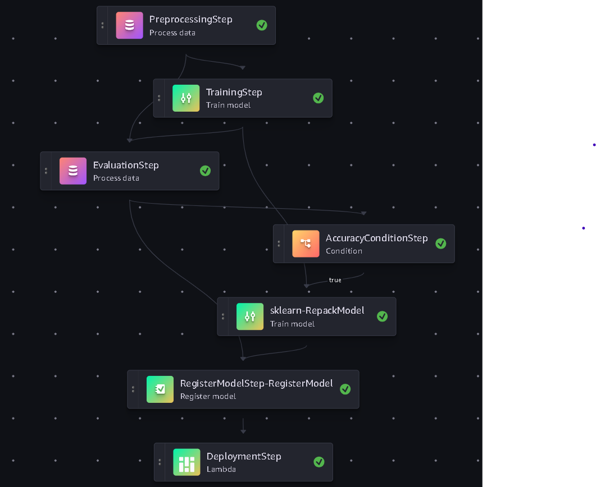

# Diabetes Prediction Pipeline using Amazon SageMaker

## Table of Contents

- [Introduction](#introduction)
- [Project Overview](#project-overview)
- [Architecture and Workflow](#architecture-and-workflow)
- [Prerequisites](#prerequisites)
- [Project Structure](#project-structure)
- [Setup Instructions](#setup-instructions)
- [Pipeline Steps](#pipeline-steps)
  - [1. Data Preprocessing](#1-data-preprocessing)
  - [2. Model Training](#2-model-training)
  - [3. Model Evaluation](#3-model-evaluation)
  - [4. Conditional Model Registration and Deployment](#4-conditional-model-registration-and-deployment)
- [Running the Pipeline](#running-the-pipeline)
- [Testing the Deployed Model](#testing-the-deployed-model)
- [Cleanup](#cleanup)
- [Conclusion](#conclusion)

## Introduction

This project implements a machine learning pipeline for predicting diabetes using the Amazon SageMaker Pipelines service. The pipeline automates the end-to-end machine learning workflow, including data preprocessing, model training, evaluation, conditional model registration, and deployment to an endpoint for real-time inference.

## Project Overview

The goal is to predict whether an individual is diabetic based on various health indicators and symptoms. The pipeline uses a Random Forest classifier implemented in scikit-learn to perform the classification task.

## Architecture and Workflow

The pipeline consists of several steps executed sequentially:

1. **Data Preprocessing**: Cleans and prepares the dataset for training and testing.
2. **Model Training**: Trains a Random Forest classifier on the preprocessed data.
3. **Model Evaluation**: Evaluates the trained model against a test dataset.
4. **Conditional Model Registration and Deployment**: If the model meets the specified accuracy threshold, it is registered in the Model Registry and deployed to an endpoint using an AWS Lambda function.

### Workflow Diagram

Below is a diagram of the pipeline workflow:



## Prerequisites

- An AWS account with access to Amazon SageMaker services.
- AWS CLI configured with appropriate permissions.
- Python 3.7 or higher installed locally.
- IAM roles with the necessary permissions for SageMaker execution and Lambda execution.

## Project Structure

```
 diabetes-prediction-sagemaker/
  ┣ .github
  ┃ ┗ workflows
  ┃ ┃ ┗ ci_cd_pipeline.yml
  ┣ data
  ┃ ┗ diabetes_data.csv
  ┣ src
  ┃ ┣ __init__.py
  ┃ ┣ deploy.py
  ┃ ┣ evaluate.py
  ┃ ┣ inference.py
  ┃ ┣ preprocessing.py
  ┃ ┗ train.py
  ┣ test
  ┃ ┗ test_endpoint.py
  ┣ README.md
  ┣ pipeline.py
  ┗ requirement.txt
```

- `.github/workflows/ci_cd_pipeline.yml`: Github action workflow.
- `src/preprocessing.py`: Script for data preprocessing.
- `src/train.py`: Script for training the model.
- `src/evaluate.py`: Script for evaluating the model.
- `src/inference.py`: Script containing inference code for deployment.
- `src/deploy.py`: Lambda function script for deploying the model.
- `test/test_endpoint.py`: Script to test the deployed endpoint.
- `pipeline.py`: Defines the SageMaker pipeline.
- `requirements.txt`: Python dependencies.
- `README.md`: Project documentation.

## Setup Instructions

1. **Clone the Repository**

   ```bash
   git clone https://github.com/your-username/diabetes-prediction-sagemaker.git
   cd diabetes-prediction-sagemaker
   ```

2. **Install Dependencies**

   ```bash
   pip install -r requirements.txt
   ```

3. **Configure AWS Credentials**

   Ensure that your AWS CLI is configured with the necessary permissions:

   ```bash
   aws configure
   ```

4. **Upload Data to S3**

   Place your dataset (`diabetes_data.csv`) in an S3 bucket accessible to SageMaker.

## Pipeline Steps

### 1. Data Preprocessing

- **Script**: `src/preprocessing.py`
- **Processor**: `ScriptProcessor` using the scikit-learn image.
- **Function**:
  - Reads raw data from S3.
  - Handles missing values and encodes categorical variables.
  - Splits data into training and testing sets.
  - Saves the processed datasets back to S3.

### 2. Model Training

- **Script**: `src/train.py`
- **Estimator**: `SKLearn` estimator.
- **Function**:
  - Loads the training data.
  - Trains a Random Forest classifier.
  - Saves the trained model artifact (`model.joblib`).

### 3. Model Evaluation

- **Script**: `src/evaluate.py`
- **Processor**: `ScriptProcessor` using the scikit-learn image.
- **Function**:
  - Loads the trained model and test data.
  - Evaluates the model's accuracy and other metrics.
  - Saves the evaluation report (`evaluation.json`).

### 4. Conditional Model Registration and Deployment

- **Condition**: Checks if the model accuracy meets the specified threshold.
- **RegisterModelStep**:
  - Registers the model in the SageMaker Model Registry.
- **LambdaStep (Deployment)**:
  - Invokes `src/deploy.py` Lambda function.
  - Deploys the registered model to an endpoint.

## Running the Pipeline

1. **Update IAM Roles**

   Ensure that the IAM roles specified in `pipeline.py` have the necessary permissions.

2. **Modify Pipeline Parameters**

   In `pipeline.py`, adjust the following parameters if needed:

   - `input_data`: S3 path to your dataset.
   - `accuracy_threshold`: Desired accuracy threshold for model deployment.
   - `model_package_group_name`: Name for the Model Package Group.
   - `endpoint_name`: Name for the SageMaker endpoint.

3. **Execute the Pipeline**

   Run the pipeline script to create and start the pipeline:

   ```bash
   python3 pipeline.py
   ```

   This script will:

   - Create or update the pipeline definition.
   - Start a new pipeline execution.

4. **Monitor the Pipeline**

   - Use the SageMaker Console to monitor the pipeline execution.
   - Navigate to **Amazon SageMaker > Pipelines**.
   - Select **DiabetesPredictionPipeline** to view execution details.

## Testing the Deployed Model

1. **Invoke the Endpoint**

   Use the following Python script to send a test request to the endpoint:

    ```bash
    python3 test/test_endpoint.py
    ```

2. **Interpret the Results**

   The prediction will be an array indicating the class label predicted by the model (e.g., `[1]` for diabetic).

## Cleanup

To avoid incurring unnecessary costs, clean up the resources created:

- **Delete the Endpoint**

  ```bash
  aws sagemaker delete-endpoint --endpoint-name DiabetesPredictionEndpoint
  ```

- **Delete the Pipeline**

  ```bash
  aws sagemaker delete-pipeline --pipeline-name DiabetesPredictionPipeline
  ```

- **Delete S3 Objects**

  Remove the S3 objects and folders created during the pipeline execution.

## Conclusion

This project demonstrates how to build an automated machine learning pipeline using Amazon SageMaker Pipelines. By following the steps outlined, you can preprocess data, train and evaluate a model, and deploy it for real-time inference, all within a scalable and maintainable framework.

---

**Note**: Always ensure that you have the necessary permissions and that you comply with AWS best practices when deploying resources.

## License

This project is licensed under the MIT License.
